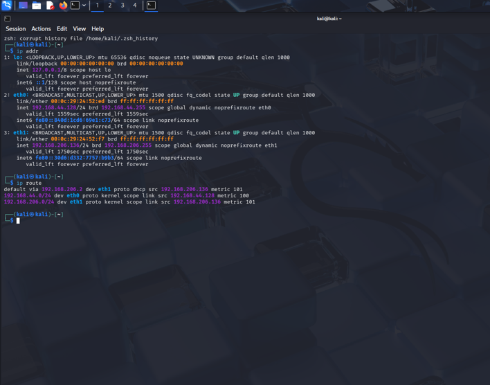

# Network_Task_02_AkhilSPramod
##Task: Networking Task 02 – Network Devices & IP Addressing
---

##Part A: Network Devices Research

#Router : 
Purpose : Connects different networks together and routes data packets between them, typically connecting a home/office LAN to the Internet.
How It Works : Operates at Layer 3 (Network Layer) of the OSI model. Uses routing tables and protocols (like OSPF, BGP) to determine the best path for each packet. Performs NAT (Network Address Translation) to map private IPs to a public IP.
Real-World Usage : Home broadband router (e.g., TP-Link, Netgear) connects all devices in a house to the ISP. Enterprise routers connect branch offices to HQ via WAN links.

#Switch :
Purpose : Connects multiple devices within the same LAN and intelligently forwards frames only to the intended destination device.
How It Works : Operates at Layer 2 (Data Link Layer). Maintains a MAC address table (CAM table). When a frame arrives, it reads the destination MAC and forwards the frame only to the correct port, reducing unnecessary traffic (unlike a hub).
Real-World Usage : Cisco/HP switches in office networks connect all PCs, printers, and servers. Managed switches allow VLAN segmentation and QoS configuration.

#Hub :
Purpose	Connects multiple devices in a LAN but forwards incoming data to ALL connected ports, regardless of the intended destination.
How It Works	Operates at Layer 1 (Physical Layer). Acts as a repeater – it simply amplifies and broadcasts the electrical signal to every port. All devices share the same collision domain, leading to inefficiency and collisions.
Real-World Usage	Largely obsolete today. Was used in early Ethernet LANs. Still occasionally found in very small/cheap setups or used in labs for packet sniffing (since all traffic is visible on every port).

#Access Point (AP)
Purpose:	Provides wireless (Wi-Fi) connectivity and acts as a bridge between wireless clients and the wired LAN.
How It Works:	Operates at Layer 2. Broadcasts an SSID (Wi-Fi network name) and handles 802.11 (Wi-Fi) protocol. Devices authenticate via WPA2/WPA3 and the AP maps wireless MACs to the wired network.
Real-World Usage:	Wi-Fi routers in homes include a built-in AP. Enterprise environments deploy standalone APs (e.g., Cisco Aironet, Ubiquiti UniFi) across floors, managed by a wireless controller.

#Firewall
Purpose :	Monitors and controls incoming/outgoing network traffic based on predefined security rules. Acts as a security barrier between trusted and untrusted networks.
How It Works:	Can operate at Layer 3/4 (packet filtering – checks IP, port, protocol) or Layer 7 (application firewall – deep packet inspection). Stateful firewalls track connection states. Rules define what traffic is ALLOW or DENY.
Real-World Usage :	pfSense/iptables on Linux for home labs. Palo Alto, Cisco ASA, Fortinet FortiGate in enterprises. Cloud firewalls (AWS Security Groups, Azure NSG) for cloud infrastructure.

#Modem
Purpose :	Modulates digital signals into analog (and demodulates the reverse) to transmit data over telephone lines, cable lines, or fiber. Connects the home network to the ISP.
How It Works :	MOdulator-DEModulator. Converts digital data from a router/PC into a signal suitable for the physical medium (DSL over phone line, DOCSIS over cable, etc.). The ISP side has a matching modem (DSLAM, CMTS) that demodulates the signal back to digital.
Real-World Usage :	DSL modem for BSNL broadband in India. Cable modem for Hathway/ACT. Many ISPs now provide a modem+router combo device (gateway).

---

###Part B: IP Address Classification
RFC 1918 defines the following ranges as private (non-routable on the public Internet):
•	10.0.0.0 – 10.255.255.255 (Class A private)
•	172.16.0.0 – 172.31.255.255 (Class B private)
•	192.168.0.0 – 192.168.255.255 (Class C private)

---

###Part C: Understanding Your Network

Sample Network Configuration (Lab Environment – Kali Linux VM)

IPv4 Address	192.168.56.101 (Host-only adapter – lab network)
Subnet Mask	255.255.255.0 (/24)
Default Gateway	192.168.56.1
DNS Server	8.8.8.8 (Google DNS, configured in /etc/resolv.conf)
IP Range	192.168.56.0/24 – Private range (RFC 1918, Class C)
Public or Private?	Private – not directly routable on the Internet

Analysis Questions
Q1: Which IP range does your device belong to?
192.168.56.0/24 – a Class C private range. This is the Host-only network created by VMware, used for internal VM-to-host communication only.

Q2: Is it Public or Private?
Private. The 192.168.x.x range is defined as private in RFC 1918. It is not routable on the public Internet. The router (or VMware NAT adapter) performs NAT to give Internet access.

Q3: What role does your router play in your network?
The router (default gateway at 192.168.56.1) acts as the exit point for all traffic leaving the local network. It performs NAT – translating private IPs to the single public IP assigned by the ISP. It also handles routing decisions, forwarding packets to the correct next hop toward their destination.

Q4: What would happen if the DNS server stopped working?
All domain name resolution would fail. Users would be unable to browse websites by name (e.g., www.google.com). However, direct IP access would still work (e.g., ping 8.8.8.8). Applications that hard-code IPs would continue functioning. In practice, this makes the Internet appear 'broken' for most users since browsers rely entirely on DNS.

---

###Part D: Network Communication Flow – Opening www.google.com
Communication Flow Diagram
Your Device → Router → ISP → DNS Server → Google's IP resolved → Google's Web Server → Response returns to Device

